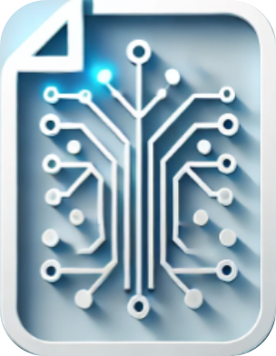
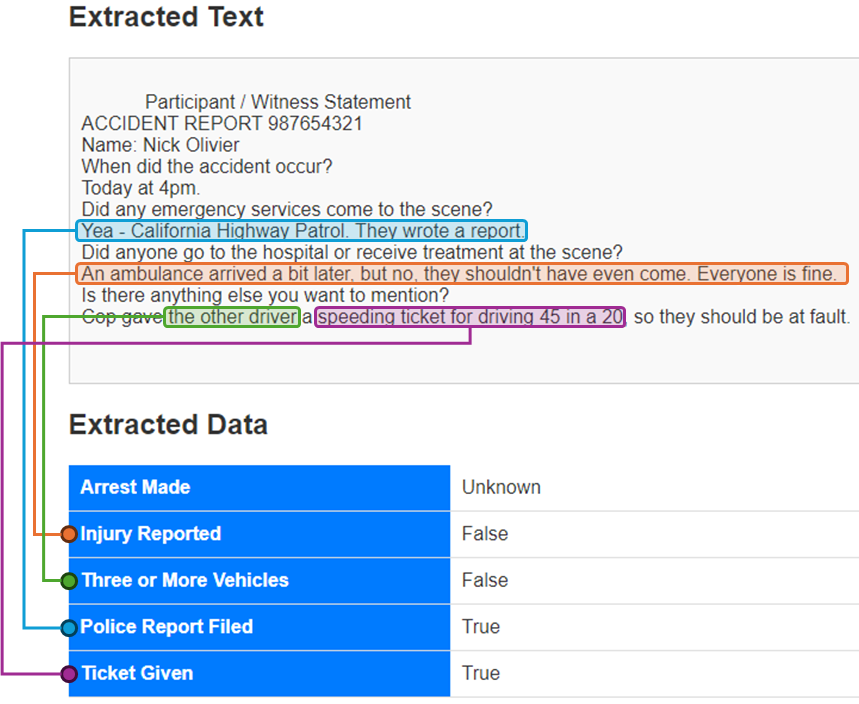

##  Intelligent Document Parser

[](https://opensource.org/licenses/MIT)

## Overview

The **Intelligent Document Parser** is a Flask application that allows users to upload files (PDF, JPEG, PNG, TXT) and leverages AI techniques to extract meaningful data from them. The system supports OCR (Optical Character Recognition) for image files, and it parses files to provide structured information in a user-friendly table format. The project uses [NLP Cloud](https://nlpcloud.com/) to access large language models.

Given an uploaded document, the app answers specific questions using the content of the file.




## Features

- **Upload Support**: Upload documents in formats such as `.pdf`, `.jpg`, `.jpeg`, `.png`, and `.txt`.
- **Text Extraction**: Extracts raw text from documents using custom AI modules.
- **Parsed Data Display**: Presents extracted data in a clean table format.
- **OCR Support**: For image formats like JPG, PNG, etc., OCR is used to extract text from images.

## Project Structure

```
llm_document_parsing/
│
├── app.py                # Main Flask application
├── templates/
│   ├── upload.html       # Upload page template
│   ├── result.html       # Results page template
│
├── static/
│   ├── css/
│   │   └── style.css     # Custom styles for the app
│   ├── images/
│   │   └── logo.png      # Logo for the project
│
├── src/
│   ├── text_extraction.py # Text extraction logic
│   ├── intelligent_parsing.py # AI parsing logic
│
├── data/
│   └── example.pdf       # Example data file
│
├── README.md             # Project documentation (this file)
└── requirements.txt      # List of dependencies for the project
└── .env                  # Credential storage file
```

## Requirements

- Python 3.x
- Flask
- Pillow (for image handling)
- Tesseract-OCR (for OCR support)
- Pandas

You can install all the required Python dependencies by running:

```bash
pip install -r requirements.txt
```


## Setup Instructions

1. **Clone the Repository**:

   ```bash
   git clone https://github.com/OlivierNDO/llm_document_parsing.git
   cd llm_document_parsing
   ```

2. **Install Dependencies**:

   Install the required Python libraries:

   ```bash
   pip install -r requirements.txt
   ```

3. **Insert an api token for NLP Cloud in an environment file (.env)**

	```bash
	token=your_nlp_cloud_token_here
	```


3. **Run the Flask App**:

   Start the application by running:

   ```bash
   python app.py
   ```

4. **Access the App**:

   Open your browser and navigate to `http://127.0.0.1:5000/` to use the Intelligent Document Parser.

## Usage

1. **Upload a File**: On the homepage, you can upload files in `.jpg`, `.jpeg`, `.png`, `.pdf`, or `.txt` format.
2. **View Extracted Text**: After the file is uploaded, the raw extracted text will be displayed along with the parsed data in a table format.
3. **Navigate Back**: Use the "Back to Upload" button to upload another file.


## Contact
[](https://www.linkedin.com/in/oliviernicholas/)
